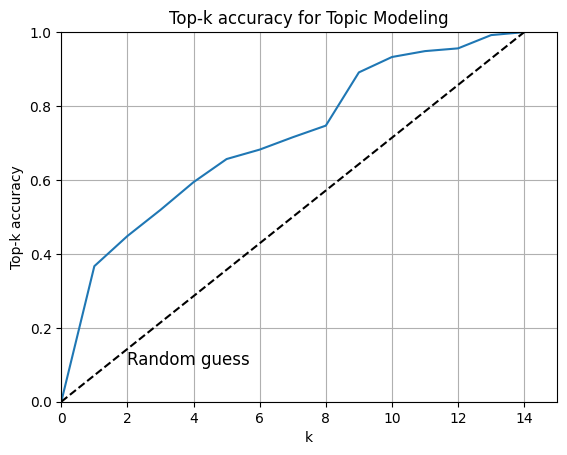

# Computer Screenshot Classification for Boosting ADHD Productivity in a VR environment

   

**This repository contains the code for the author's Bachelor's Thesis. You can find the written report [here](/docs/GonzaloCordova_TFG.pdf).**
- **Title**: Computer Screenshot Classification for Boosting ADHD Productivity in a VR environment
- **Author**: Gonzalo Córdova Pou
- **Supervisor**: Silverio Martínez-Fernández, Department of Service and Information System Engineering
- **Institution**: Universitat Politècnica de Catalunya (UPC)
    - Schools: Barcelona school of Informatics, Barcelona School of Telecommunications Engineering, School of Mathematics and Statistics
- **Co-supervisors**: David C. Shepherd (Louisiana State University), Juliana Souza (Virginia Commonwealth University)

Individuals with ADHD face significant challenges in their daily lives due to difficulties with attention, hyperactivity, and impulsivity. These challenges are especially pronounced in the workplace or educational settings, where the ability to sustain attention and manage time effectively is crucial for success. Virtual reality (VR) software has emerged as a promising tool for improving productivity in individuals with ADHD. However, the effectiveness of such software depends on the identification of potential distractions and timely intervention.

The proposed computer screenshot classification approach addresses this need by providing a means for identifying and analyzing potential distractions within VR software. By integrating Convolutional Neural Networks (CNNs), Optical Character Recognition (OCR), and Natural Language Processing (NLP), the proposed approach can accurately classify screenshots and extract features, facilitating the identification of distractions and enabling timely intervention to minimize their impact on productivity.

The implications of this research are significant, as ADHD affects a substantial portion of the population and has a significant impact on productivity and quality of life. By providing a novel approach for studying, detecting, and enhancing productivity, this research has the potential to improve outcomes for individuals with ADHD and increase the efficiency and effectiveness of workplaces and educational settings. Moreover, the proposed approach holds promise for wider applicability to other productivity studies involving computer users, where the classification of screenshots and feature extraction play a crucial role in discerning behavioral patterns.

## Index

1. [Repository structure](#repository-structure)
2. [Proposed solution](#proposed-solution)
    1. [Dataset](#dataset)
    2. [CNN Distraction Detector](#cnn-distraction-detector)
    3. [OCR Text Extraction](#ocr-text-extraction)
    4. [NLP Binary Classifier](#nlp-binary-classifier)
    5. [Topic Modeling](#topic-modeling)

---

## Repository Structure

- `docs`: Documentation files.
    - `GonzaloCordova_TFG.pdf`: Bachelor's Thesis report.
- `.codecarbon.config`: Configuration file for the CodeCarbon tool.
- `.gitignore`: Git ignore file.
- `CNNclassifier.py`: Python module with the CNN model and the functions to train, test and predict.
- `distraction_detector_lab.py`: Distraction Detector Loop with intervention (CNN model, for testing intervention parameters).
- `distraction_detector.py`: Distraction Detector Loop with intervention (CNN model, for deployment).
- `environment.yml`: Conda environment file.
- `Experiment_colab.ipynb`: Notebook to run experiments(train, test...) for the CNN Distraction Detector in Google Colab.
- `Experiment_local.ipynb`: Notebook to run experiments (train, test...) for the CNN Distraction Detector in local environment. Main notebook used for the experiments during the development of the project.
- `image2text.py`: Script to create a text dataset from the image dataset (using OCR).
- `LocalDatasetPreprocessing.ipynb`: Notebook to preprocess the local dataset (from raw to structured).
- `NLP_BinaryClassifier_demo.ipynb`: Demo notebook to load and test the Binary Classifier.
- `NLP_BinaryClassifier.ipynb`: Notebook to train and test the Binary Classifier model.
- `NLPutils.py`: Python module with the functions to preprocess the text data and apply NLP techniques for topic modeling.
- `OCRtest.py`: Script to test OCR techniques on screenshots.
- `README.md`: This file.
- `requirements.txt`: Python requirements file.
- `feature_logger.py`: Script to take screenshots and log the feature extraction (text and class).
- `image2text.py`: Script to create a text dataset from the image dataset (using OCR).
- `BinaryClassifier_demo.ipynb`: Notebook to test the Binary Classifier.
- `TopicModeling.ipynb`: Notebook showcasing the topic modeling process.

---

## Proposed solution

This proposed solution presents a novel approach for studying and detecting potential distractions in VR
software, using a combination of Convolutional Neural Networks (CNNs) and Optical Character Recognition
(OCR) with Natural Language Processing (NLP) techniques. The solution aims to classify screenshots as
either ”focused” or ”distracted” content, using both image and text-based approaches, and subsequently
extracting features to identify distractions and study patterns in the ”focused” category.

---

### Dataset

The dataset for this project is not publicly available due to privacy concerns. However, the dataset is structured as follows:

| Dataset | Total | Focused | Distracted | Full | Partial |
| --- | --- | --- | --- | --- | --- |
| dataset4 | 14,191 | 9,178 (64.67%) | 5,013 (35.33%) | 9,879 (69.61%) | 4,312 (30.39%) |

Focused screenshots are those that were taken during study sessions. Examples of focused screenshots include reading a PDF, writing an essay, watching a video lecture, or taking notes.

Distracted screenshots are those that were taken during non-study sessions. This category includes screenshots of the screen while, for example, using social media, watching videos, reading news articles, or playing games.

In addition, images with the ”focused” label were also manually segmented in the college course the
user was working on. This was known by observing the screenshot or the session video sequence if necessary.
The list of courses observed was: ”Art”, ”Astronomy”, ”Biology”, ”Business”, ”Physics”, ”Chemistry”,
”Maths and Statistics”, ”ComputerScience”, ”Pharmacology”, ”Psychology”, ”Literature”, ”Ethics and
Philosophy”, ”Politics and Society” and ”Gender”.

---

### CNN Distraction Detector

We adapted the resnet50 network architecture in a simple way. We transformed the class space of the pre-trained
model by replacing the last layer (containing 1000 neurons for the ImageNet dataset) with a fully connected
layer of 512 neurons (with ReLU activation and dropout) and adding a last layer with two neurons + log-
Softmax activation function for binary classification. The use of two neurons instead of one was a decision
to facilitate the extension to multiclass classification if desired in the future. In addition, the negative
log-likelihood loss was used for training.

- You can use the `CNNclassifier.py` module to train, test and predict with the CNN model.
- You can use either Experiment_local.ipynb or Experiment_colab.ipynb to run experiments (train, test...) for the CNN Distraction Detector.
- You can use the `distraction_detector.py` script to run the Distraction Detector Loop with intervention (CNN model, for deployment).
- You can use the `distraction_detector_lab.py` script to run the Distraction Detector Loop with intervention (CNN model, for testing intervention parameters).

**For those seeking to directly test and utilize the Distraction Detector (CNN binary classification model) we have provided a Hugging Face Space:**

*Disclaimer: It is important to acknowledge that the training, testing, and deployment
experiments of the models were conducted within the constraints and controlled domain of the Alerta
project. Therefore, it is crucial to recognize that the models will have inherent
biases (e.g. location, operating system, desktop background) due to the specific context in which they
were developed.*

Results:

| Frozen | Optimizer | Batch size | Learning rate | Accuracy | F1-score | Precision | Recall |
| --- | --- | --- | --- | --- | --- | --- | --- |
| False | Adam | 128 | 0.01 | 0.951 | 0.951 | 0.955 | 0.951 |
| False | Adam | 128 | 0.001 | 0.99 | 0.99 | 0.99 | 0.99 |
| False | Adam | 128 | 0.0001 | 0.992 | 0.992 | 0.992 | 0.992 |
| False | Adam | 64 | 0.001 | 0.992 | 0.992 | 0.993 | 0.992 |

---

### OCR Text Extraction

- You can use the `image2text.py` script to create a text dataset from the image dataset (using OCR).
- You can use the `OCRtest.py` script to test OCR techniques on screenshots.

---

### NLP Binary Classifier

- You can use the `NLP_BinaryClassifier.ipynb` notebook to train and test the Binary Classifier model.
- You can use the `NLP_BinaryClassifier_demo.ipynb` notebook to load and test the Binary Classifier.

Results:

| Accuracy | F1-score | Precision | Recall | Model |
| --- | --- | --- | --- | --- |
| 0.962 | 0.944 | 0.938 | 0.95 | Random Forest |
| 0.928 | 0.89 | 0.976 | 0.818 | Multinomial Naive Bayes |
| 0.667 | 0.15 | 1 | 0.081 | Logistic Regression (C = 0.01) |
| 0.904 | 0.841 | 0.98 | 0.736 | Logistic Regression (C = 0.1) |
| 0.966 | 0.951 | 0.967 | 0.935 | Logistic Regression (C = 1) |
| 0.972 | 0.959 | 0.978 | 0.941 | Logistic Regression (C = 2) |
| 0.968 | 0.953 | 0.965 | 0.941 | Logistic Regression (C = 5) |

---

### Topic Modeling

Obtain the fastText word embeddings [here](https://fasttext.cc/).

In our topic modeling approach, each topic is represented by a set of keywords. These keywords define
the topic and serve as the basis for computing their respective embeddings. The topic embedding is
obtained by calculating the centroid of the embeddings of the keywords. By utilizing the topic centroid,
we can identify the most similar topics to a given text.

- You can use the `TopicModeling.ipynb` notebook to run the topic modeling process.
- You can use the `NLPutils.py` module to preprocess the text data and apply NLP techniques for topic modeling.

Results:

**For those seeking to directly test and utilize the Distraction Detector (CNN binary classification model) we have provided a Hugging Face Space:**

*Disclaimer: It is important to acknowledge that the training, testing, and deployment
experiments of the models were conducted within the constraints and controlled domain of the Alerta
project. Therefore, it is crucial to recognize that the models will have inherent
biases (e.g. location, operating system, desktop background) due to the specific context in which they
were developed.*

---

## License

Distributed under the MIT License. See LICENSE.txt for more information.

---

## Contact

Gonzalo Córdova Pou

 