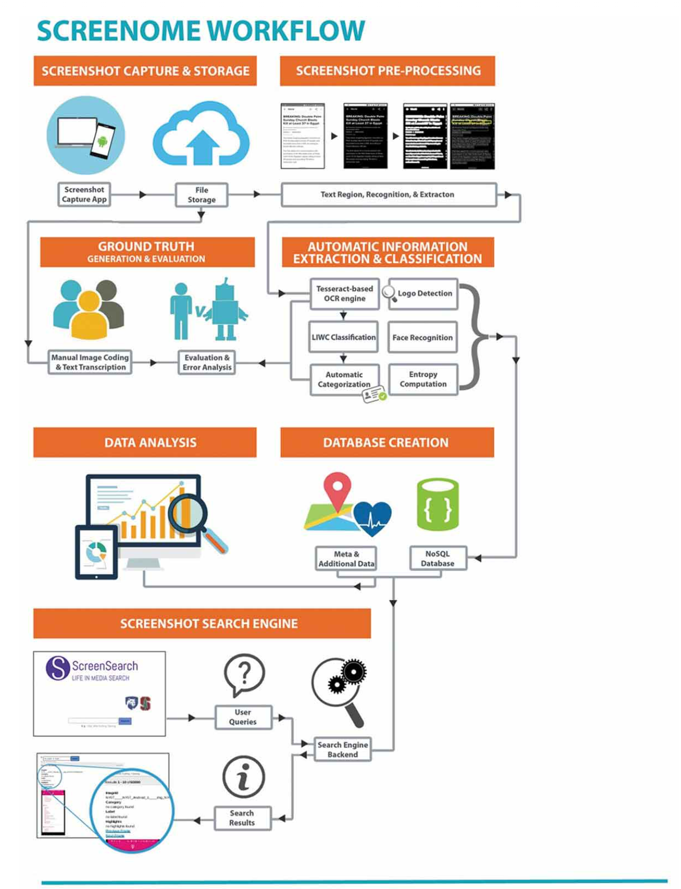

# Related work

## Index

- [Article 1](#article-1) CNN for task classification using computer screenshots for integration into dynamic calendar/task management systems
- [Article 2](#article-2) Guess What's on my Screen? Clustering Smartphone Screenshots with Active Learning
- :star: [Article 3](#article-3) Screenomics: A New Approach for Observing and Studying Individuals’ Digital Lives
- :star: [Article 4](#article-4) Screenomics: A Framework to Capture and AnalyzePersonal Life Experiences and the Ways thatTechnology Shapes Them 
- [Article 5](#article-5) Text Extraction from Smartphone Screenshots to Archive in situ
Media Behavior
- [Article 6](#article-6) Understanding Screen Relationships from Screenshots of Smartphone Applications

### Article 1
#### **CNN for task classification using computer screenshots for integration into dynamic calendar/task management systems.**

[Link to the article](http://cs231n.stanford.edu/reports/2015/pdfs/anand_avery_final.pdf)\
**Authors:** Anand Sampat, Avery Haskell - Stanford University 

**Context:** This is an unpublished manuscript of 2015 that appears to be cited in 5 other published articles according to Google Scholar. 

**Summary:** This project aims to classify high level tasks (e.g. ‘checking emails’, ‘photo editing’, ‘social media’) a user does on his or her computer using deep CNN networks. The technique of transfer is implemented using scene-classification pretrained models which provide weights that significantly reduce training time by placing the solver in a state closer to the optimal state. It explores two datasets – one small (1900 training examples), and one larger (10,800 training images). Moreover, additional work in window detection and streaming data (time component) is carried out. 

**Core idea:**
1. Elaboration of a new screenshot labeled dataset using automated image search from search engine scraping and screenshots taken at regular intervals from a computer.
2. Overcoming data challenges: Data sparsity with data augmentation (moving windows); Data Diversity by avoiding too homogeneous data (e.g. OS, theme, color scheme); Data Cleaning by hand curation, duplicate removal and filters.
3. The backbone architecture of the model is the Hybrid CNN. This architecture is simplified by reducing the number of layers. The architecture was pre-trained on the Places205CNN dataset from MIT and by freezing some of the layers and training only the last 3 to 5 layers the new model is obtained.
4. Finally, work on data interpretation is also presented. As a result of these observations the papers explores two possibilities:
    - a) Window detection: using bounding boxes to capture different windows in the screen (OpenCV library: canny edge detection).
    - b) Streaming data: aiming to capture the idea that temporal context is important to classification by using more than one image (10 sec intervals) to make a prediction.
 

**Conclusion:**
- On a large dataset the best model performed reasonably with 64% accuracy using a CNN with weights from hybridCNN training and retraining the last conv layer and the two fully-connected layers on 10,800 images. 
- Despite not showing accurate results, the paper suggests that in order to better integrate this, data streaming is very important. Furthermore, obtaining contextual cues via segmentation of the image with bounding boxes can be used in conjunction with a contextually constrained deep network to improve task labeling.

### Article 2
#### **Guess What's on my Screen? Clustering Smartphone Screenshots with Active Learning**

[Link to the article](https://arxiv.org/pdf/1805.07964.pdf)

**Authors:** Agnese Chiatti, Dolzodmaa Davaasuren, Nilam Ram, Prasenjit Mitra, Byron Reeves, Thomas Robinson - The Pennsylvania State University & Stanford University

**Context:** This paper was published in January 2019 as a collaboration between The Pennsylvania State University and Stanford University. Stanford University involved their [Screenomics Lab](https://screenomics.stanford.edu/) members for useful discussions and acknowledge the data and computational support provided for the experiments. Cited by: 2;
 

**Abstract:** The heterogeneous content in screenshot images makes manual annotation cumbersome and costly. Thus, the paper proposes a framework that combines K-Means clustering with Active Learning to efficiently classify large screenshot sets when only a limited amount of labels is available. The framework uses SVM-embedded or XGBoost-embedded solutions for class probability propagation to discover latent classes and assess the relative contribution of multimodal features to overall performance.
 

**Takeaways:**
- "Classification, however, can be cumbersome especially for screenshots, that include nested data streams (images, text),
presented over diverse templates. For instance, if Figures 1a and 1b are compared, one can see how the proportion
of text over icons and graphical content is different. Plus, in Figure 1b specifically, more complex frames (i.e., video
previews) are alternated with textual contents and titles. As such, smartphone screenshots form a unique, yet rather
unexplored, data typology, providing opportunities to test state-of-the-art methods for data clustering and classification
on an unusual collection."
- **Related work**:
   - **Image classification:** "Nonetheless, we have found it to be a rather unexplored domain. The work conducted in [8], is the most similar found to our case. The authors, Sampat et al., used a 3-layered convolutional network to classify a dataset of laptop screenshots
over 14 classes. The architecture was pre-trained on the Places205CNN dataset from MIT, with the weights then
transferred over to classify the target laptop screenshots. They concluded that the architecture was not effective for
classification. However the implications of training directly on screenshots (i.e., instead of using hyperparameters
learned from more general image collections) were not addressed. Furthermore, our target images are still relatively
different from the aforementioned set, as dealing with smartphone screenshots allows to skip the identification of the
main active window on the screen, reducing the risk of error propagation from the latter step to the feature extraction
phase."
   - **Text classification:** When dealing with images, the classification problem is usually tackled from a Computer Vision perspective, rather
than relying on extracted textual contents. In fact, text extraction is error-prone, and can introduce more noise in the
data analysis. On the other hand, images that are not visually similar, could actually have similar contents. Furthermore,
smartphone screenshot images are, on average, much more textually dense than the images included in popular image
collections [12]. The evidence of segmentation defects on OCR-extracted text from digital screenshots [13], support the
use of text as an auxiliary component that can be used in classification.
  - **Multi-modal learning:** Joint-learning of image-text embeddings [14] has been applied to image datasets associated with transcribed captions to
improve entity localization. Recent work has shown how multi-modality can lead to better knowledge capture, especially
when extrapolating low-level concepts from the represented entities [15]. In this context, text was pre-processed by
applying known techniques in Text Classification, e.g. word2vec [9] or GloVe [11], to be more uniformly merged with
the image vectors [16]. In other cases, visual patterns and textual features have also been learned jointly for automated
event extraction [17].
However, to our knowledge, none of the reviewed multi-modal approaches have been tested on digital screenshots. In
the related literature, these methods are typically applied on image caption learning [18], question answering tasks [16],
or sematic triple representation learning [19]. Instead, we include the full textual data as a feature, and measure the
relative impact of multi-modal feature sources on the resulting cluster validity.
- **Text Processing:** For each input screenshot, the textual content extracted through a combination of Image Processing
and OCR is also retrieved, when available. First, we applied whitespace-based tokenization to the raw text and removed
punctuation. Then, all the resulting tokens were reduced to lowercase.
- **Text Vector Representation:** To obtain a vectorized representation of the text that was similarly dense, when compared
to the aforementioned visual feature vectors, we utilized GloVe pre-trained 300-dimensional word embeddings derived
from the Wikipedia 2014 and Gigaword 5 data sets and accounting for 6 Billion tokens in total. Word embeddings
are combined through the following workflow: (i) for each token in the screenshot text, the corresponding semantic
vector is retrieved, if the considered token is found in the reference vocabulary, (ii) a zero-valued vector is associated to
each unknown token, (iii) the overall vector describing the full document is obtained from the weighted average of
word embeddings identified in the first phase, using TF-IDF values as weights. Finally, (iv) zero-valued vectors are
associated to all the screenshots that did not contain any text.*
- **Conclusion:** "This paper presented exploratory analyses on clustering smartphone screenshots based on multimodal (visual and
textual) features. Semi-supervised clustering was applied in combination with two alternative supervised classifiers, to
propagate class probabilities from the labeled subset. Manually annotated labels were produced through active learning methods, i.e., after informative and diverse batch selection.
We found that performance, expressed in terms of cluster validity, was comparable with respect to the employed
classifier and can, by all means, be further ameliorated. Further, **the current representation of textual features, on
average, led to a slight performance decrease**. All cases, nonetheless, showed a quite persistent performance even after
increasing the size of the labeled sample."
- **Future work:** 
   1. revising the strategies and methods used to create ad hoc image-text embeddings
   2. refining the taxonomy used for annotating screenshots, mirroring
the newly-formulated representation
   3. Further, in the experimented setting, labels were simply provided by human
annotators, based on the given taxonomy and on their sole judgement. However, refinements in representing and
classifying the content could possibly lead to providing human judges with a set of top candidate label suggestions to
choose from, to further leverage manual and automated categorization and in the attempt to minimize the individual
bias.

### Article 3
#### **Screenomics: A New Approach for Observing and Studying Individuals’ Digital Lives**
[Link to the article](https://journals.sagepub.com/doi/pdf/10.1177/0743558419883362)

**Authors:** Nilam Ram , Xiao Yang, Mu-Jung Cho, Miriam Brinberg, Fiona Muirhead, Byron Reeves, and Thomas N. Robinson\
**Context:** Cited by: 39; Institution: Stanford University, Pennsylvania State University, University of Strathclyde; Journal: Journal of Adolescent Research\
**Keywords:** screenomics, screenome, smartphone, social media, adolescence, digital media, intensive longitudinal data, experience sampling\
**Abstract:** The article presents "screenomics," a new approach for studying individuals' digital experiences. The study analyzed over 500,000 smartphone screenshots from four Latino/Hispanic youth aged 14 to 15 years from low-income, racial/ethnic minority neighborhoods using computational machinery and machine learning algorithms. The results show how adolescents' digital lives differ across persons, days, and hours, highlighting their switching among multiple applications and exposure to different content. The authors suggest that screenomics can provide more detailed data for studying digital lives and testing theories about media use and development. \
**Takeaways:**
- "Consolidation of technology embedded into smartphone devices mean
that it is now possible to switch between radically different content on a single screen on the order of seconds—for example, when an individual switches
from watching a cat video on YouTube to taking, editing, and sharing a selfie
in Snapchat to searching for a restaurant with Google to texting a friend to
arrange a time to meet. Self-reports of media exposure and behavior simply
do not provide accurate representation of digital lives that weave quickly—
often within a few seconds—between different software, applications, locations, functionality, media, and content. In contrast, the screenome—made of
screenshots taken frequently at short intervals—is a reconstruction of digital
life that contains all the information (i.e., the specific words and pictures) and
details about what people are actually observing, how they use software (e.g.,
writing, reading, watching, listening, gaming), and whether they are producing information or receiving it. The screenshots capture activity about all
applications and all interfaces, regardless of whether researchers can establish connections to the sources of information via software logging or via
relationships with businesses that own the logs (e.g., phone records, Facebook,
and Google APIs). Sequences of screenshots (i.e., screenomes) provide the
raw material and time-series records needed for fine-grained quantitative and
qualitative analysis of fast changing and highly idiosyncratic digital lives"
- "In brief, each screenshot is “sequenced” using a custom-designed module wrapped around open-source tools for image and document processing. Screenshots are:
    1. Converted from RGB to grayscale
    2. Binarized to discriminate foreground from surrounding background
    3. Segmented into blocks of text (OCR) and images, and passed through a recognition engine (Tesseract/OpenCV-based) that identifies text, faces, logos, and objects.
        - **word count**: a simple
description of quantity of text, takes a bag-of-words approach and is calculated
for each screenshot as the number of unique “words” (defined as any string of
characters separated by a space) that appeared on the screen
        - **Word velocity**, a
description of how quickly the content is moving (e.g., when scrolling through
text), is calculated as the difference between the bag-of-words obtained from
two consecutive screenshots, specifically the number of unique new words that
did not appear in the prior screenshot.
        - **sentiment analysis**
        - other language characteristics (e.g., complexity)
        - a **bagof-words analysis of the text** (LIWC, Pennebaker, Chung, Ireland, Gonzales, &
Booth, 2007) provided 93 variables that indicated (through dictionary lookup)
prevalence of first-person pronouns, social, health, and other types of words.
        - **Image complexity** was computed as the across-pixel heterogeneity (i.e.,
“texture”), as quantified by entropy of an image across 256 gray-scale colors
        - **Image velocity**, a description of visual flow, was then calculated for each screenshot as the change in image complexity from the prior
screenshot. The velocity measure (formally, the first derivative of the image
complexity time-series) indicates how quickly the content is changing (e.g.,
by analogy, how quickly a video shot pans across a scene) and is known to
influence viewers’ motivations and choices
        - **Logos are identified using template matching methods**
        - Together, the textual and graphical features provide a quantitative description of each screenshot that was used in subsequent analysis.
    4. The resulting ensemble of text snippets and image data (e.g., number of faces) are then compiled into Unicode text files, one for each screenshot, that are integrated with metadata within a document-based database that facilitates storage, retrieval (through a local API), and visualization"
- **Fine-Grained Temporal Granularity:** The high frequency of screenshot sampling allows for analysis at multiple
time scales, from seconds to hours to days to months (Ram & Reeves, 2018).
One may zoom in or out across time scales to examine specific behaviors of
finite length, cyclic or acyclic patterns of behavior, or long-term trends in
behavior that match the times scale relevant to theoretical questions (Aigner,
Miksch, Muller, Schumann, & Tominski, 2008). The screenome includes
data about particular moments in life, repeated exposures and behaviors, and
the full sequence of contiguous, intermittent, and potentially interdependent
digital experiences.
- "The screenome is the
only data that we know of that preserves the sequencing and content of all
experiences represented on digital devices and opens them up for study and
analysis of within-person behavior change."
- :star: "In parallel, selected subsets of the screenshots were used to identify and
develop schema that provided meaningful description of the media that
appeared on the screen. For example, screenshots can be tagged with codes that
map to specific behavioral taxonomies (e.g., emailing, browsing, shopping)
and content categories (e.g., food, health). Manual labeling of large data sets
often use public crowd-sourcing platforms (e.g., Amazon Mechanical Turk;
Buhrmester, Kwang, & Gosling, 2011), but the confidentiality and privacy protocols for the screenome require that labeling be done only by members of the
research team who are authorized to view the raw data. Through a secure
server, screenshot coders were presented with a series of screenshots (random
selection of sequential chunks that provided coverage across participants and
days), and they labeled the action and/or content depicted in each screenshot
using multicategory response scales (e.g., Datavyu Team, 2014) or open-ended
entry fields (QSR International Pty Ltd, 2012). These annotations were then
used both to describe individuals’ media use, and as ground truth data to train
and evaluate the performance of a collection of machine learning algorithms
(e.g., random forests) that used the textual and graphical features (e.g., image
complexity) to replicate the labeling and extend it to the remaining data."
- :star: Applications. To describe the applications that adolescents used, we manually
labeled a subset of 10,664 screenshots with the name of the specific applications appearing on the screen. Five labelers were tasked with generating
ground truth data for the machine learning algorithms. This team’s labeling
was evaluated using standard calculation of interrater reliability (κ > .90) on
test data. Discrepancies were resolved through group discussion and look-up of potential categorization by focused search of web-based information until
the matching application was identified. This ground-truth data were then
used to train a machine learning algorithm to accurately identify the application based on up to 121 textual and graphical features already extracted from
each screenshot. After multiple iterations, we obtained a random forest with
600 trees (Hastie, Tibshirani, & Friedman, 2001; Liaw & Wiener, 2002) that
had an out-of-bag error rate of only 6.8%, and used that model to propagate
the app labels to the rest of the data. Following previous research (Böhmer,
Hecht, Schöning, Krüger, & Bauer, 2011; Murnane et al., 2016), apps were
further categorized by type using the developer-specified category associated
with the app in the official Android, Google Play marketplace. Thus, each
screenshot was labeled with both the specific application name (e.g., Snapchat, Clock, Instagram, Youtube) and the more general application type. Represented types included Comics, Communication, Education, Games, Music
& Audio, Photography, Social, Study (our data collection software), Tools,
and Video Players & Editors.
- Production/consumption. Screenshots capture moments when individuals are
producing content; for example, when using the keyboard to type a text message. To identify such behavior, we manually labeled 27,000 screenshots (in
our larger repository) with respect to whether the user was producing or consuming content. These ground-truth data were then used to train an extreme
gradient boosting model (Chen, He, & Benesty, 2015; Friedman, 2001) that
accurately classified screenshots as production or consumption. After tuning,
through grid search of hyperparameters and tenfold cross-validation, performance reached 99.2% accuracy. Using this model, all screenshots were
labeled as an instance of production or consumption
- **Sentiment**. The text that appears in any given screenshot can be characterized
with respect to emotional content or sentiment (Liu, 2015). Here, we used the
modified dictionary look-up approach implemented in the sentimentr package in R (Rinker, 2018). This implementation draws from Jockers’s (2015)
and Hu and Liu’s (2004) polarity lexicons to first identify and score polarized
words (e.g., happy, sad), and then makes modifications based upon valence
shifters (e.g., negations such as not happy). A sentiment score was calculated
for each screenshot based on all the alphanumeric words extracted via optical
character regocnition (OCR) from each screenshot. Sentiment scores greater
than zero indicate that the text in the screenshot had an overall positive
valence, and scores less than zero indicate an overall negative valence.
Altogether, our combined use of feature extraction tools (e.g., OCR of
text, quantification of image complexity, logo detection), machine learning
algorithms, human labeling, and qualitative inquiry provided for rich idiographic description of the digital experiences of these adolescents’ everyday
smartphone use.\
[**Limitations and Future Directions**]
- Second, although we have all the content that appeared on the smartphone
screen, we only extracted a relatively small set of features from each screenshot
(e.g., complexity of image), only quantified sentiment of text using a single
dictionary (e.g., not sentiment of images), and only examined one type of content (food-related images and text). The analysis pipeline and procedures
developed here are being expanded (see also Reeves et al., 2019). On-going
research is expanding the feature set (e.g., using NLP, object recognition, image
clustering); expanding the perspectives from which the data are approached
(e.g., cognitive costs of task switching, language of interpersonal communication) and the types of content examined (e.g., politics, finances, health); and
examining how general and specific aspects of the screenome are related to and
interact with individuals’ other time-invariant characteristics and time-varying
behaviors.
- Third, we obtained screenshots every 5 seconds that the participants’
screens were in use during a 30- to 100-day span. While the sampling of screen
content every 5 seconds provided unprecedented detail about actual smartphone use that is not available in any other studies that we know of, the fine
granularity of the data still misses some behaviors. Our “slow frame rate”
sampling misses “quick-switches” that occur when, for instance, an individual
moves through multiple social media platforms in rapid succession as they
check what’s new, or are engaged in synchronous text message conversations
with multiple individuals simultaneously. Although costly in terms of data
transfer, storage, and computation, study of some phenomena might require
faster sampling that is closer to continuous video.
- Finally, we note that although our analysis made use of a variety of contemporary quantitative and qualitative methods, it is descriptive. We have no yet used the intensive time-series data to build and test process models of
either moment-to-moment behavior (e.g., task switching). The initial explorations here
have, however, developed a foundation for future data collection and for
analyses that make use of mathematical and logical models that support inferential and qualitative inference to many individual-level and population-level
phenomena. We look forward to the challenges and new insights yet to come.
One of the main challenges we face is the need and cost (mostly in terms of
time) of human labeling. The machine learning algorithms we used here for
identifying the application being used in each screenshot was based on a
subset of 10,664 screenshots that were labeled by our research team. Future
work will eventually require more labeling. While many big-data applications make use of crowd-sourcing platforms such as Mechanical Turk to label
data relatively cheaply, these platforms are not viable for labeling of screenome data. Given the potentially sensitive and personal nature of the data,
very strict protocols are in place to ensure that the data remain private. Thus,
labeling and coding can only be done in secure settings by approved research
staff. Our protocols underscore that the richness of the data come with social
responsibility for protection of the data contributors.
 

### Article 4

[Link to the article](https://www.tandfonline.com/doi/full/10.1080/07370024.2019.1578652)

**Title:** Screenomics: A Framework to Capture and Analyze Personal Life Experiences and the Ways that Technology Shapes Them\
**Authors:** Byron Reeves,Nilam Ram,Thomas N. Robinson,James J. Cummings,C. Lee Giles,Jennifer Pan,Agnese Chiatti,Mj Cho,Katie Roehrick,Xiao YangORCID Icon,Anupriya Gagneja,Miriam Brinberg,Daniel Muise,Yingdan Lu,Mufan Luo,Andrew Fitzgerald &Leo Yeykelis\
**Context:** Cited by: 117; Institutions: Stanford University, Pennsylvania State University; Journal: Human–Computer Interaction\
**Takeaways:**
- **Screenome:** The authors propose a new approach called "screenomics" for studying individuals' digital experiences, specifically their unique "screenome," which is the record of experiences on digital devices with screens. The screenome is composed of smartphone, laptop, and cable screens, with information sequences describing the temporal organization, content, functions, and context of person-screen interactions. It can be linked to other levels of analysis, showing how biological and cultural factors may interact with digital experiences. The screenome can provide insights into unique social, psychological, and behavioral characteristics and experiences related to individuals.
- Screenome workflow: 
- **Feature extraction**:
    - **OCR**: A major component of screenshot content is text. Some of the challengestypically associated with text extraction from degraded or natural images (e.g.,diverse text orientation, heterogeneous background luminance) are not problematicwith screenshots. But some are including inconsistency in fonts, screen layouts, andpresence of multiple overlapping windows and these problems complicate identifi-cation, extraction, and organization of textual content. Our current text extractionmodule (Chiatti et al.,2017) makes use of open-source tools: OpenCV for imagepre-processing (Culjak, Abram, Pribanic, Dzapo, & Cifrek,2012), and Tesseract forOCR (Smith,2007). As shown inFigure 1, each screenshot is first converted from RGB tograyscale and then binarized to discriminate the textual foreground fromsurrounding background. Simple inverse thresholding combined with Otsu’sglobal binarization technique (Otsu,1979) has been sufficient, given thatmost screenshots have consistent illumination across the image. Candidateblocks of text are then identified using a connected component approach(Talukder & Mallick,2014) where white pixels are dilated, and a rectangularcontour (i.e., bounding box) is wrapped around each region of text. Given thepredominantly horizontal orientation ofscreenshot text, processing efficiency ismaintained by skipping the skew estimation step. Each candidate block of textis then fed to a Tesseract-based OCRmodule to obtain a collection of textsnippets that are compiled into Unicode text files, one for each screenshot. Ourpublished studies, wherein we compared OCR results against ground-truthtranscriptions of 2,000 images, show the accuracy of the text extraction proce-dures at 74% at the individual character level (Chiatti et al.,2017). OngoingScreenomics167experiments support further improvements through the integration of neuralnet-based line recognition that is trained and tuned specifically on the expand-ing screenshot repository, similar to the approach used in the OCRopus frame-work (Breuel,2008), and included in the alpha version of Tesseract 4.0.Improvements in image segmentation, in particular, are expanding furtheropportunities for natural language processing analyses (e.g., LIWC; Pennebaker,Booth, Boyd, & Francis,2015) that are then used to identify meaningfulcontent from the extracted text.
    - Labeling (Human Tagging): There are some features of screenshots that are of theoretical interest but for which there are not yet automated methods for obtaining labels. Consequently, we facilitate labeling of individual screenshots with tools for human tagging. Humanlabeling of big data often uses public crowd-sourcing platforms (e.g., AmazonMechanical Turk; Berinsky, Quek, & Sances,2012; Bohannon,2011; Buhrmester,Kwang, & Gosling,2011; Horton, Rand, & Zeckhauser,2011). Confidentiality andprivacy protocols for the screenome require that labeling is done only by membersof the research team that are authorized to see the raw data. Manual labeling and text transcription are done using a custom module built on top of the localturkopensource API (Vanderkam,2017) and for some tasks the opensource Datavyu(2014) software.\
    \
    [**LIMITATIONS**]
    - Missing screens
    - Non-Screen Behavior
    - System Optimization \
    [**EXTENSIONS**]
    - Structured Vs. Unstructured Data
    - Creating Behavioral Indices from Screenome Data: For example, what might be the pace of screen switching for different personalities?
    - Internal and External Validity: ll of our data so far have been generated by adult volunteers recruited for theirwillingness to participate in the new research. We have deliberately recruited digitallyactive younger adults, and although the samples are balanced by gender and geography,they are not randomly selected or representative of national populations or subgroups interms of race, income, and other important characteristics that may influence technologyuse. Consequently, we have prioritized internal validity and demonstrations of the value ofscreenome data. Going forward, the samples will need to be more representative. Thereare significant known differences in how individuals use digital media (Correa et al.,2010;Jackson et al.,2008), and those differences must be reflected in future samples.
    - Between-Person Differences and Within-Person Change
    - Time-Scales: All of the screenomes reported here were constructed using screenshots takenat 5-s intervals. That interval, which is considerably faster than many experiencesampling techniques used in research, was only a first attempt to define the bestsampling frequency. The switching time results (Section 5.1) suggest using evenshorter intervals. Indeed, with 5-s intervals, we are only able to model behaviorsmanifesting at a ten-second time-scale. Screenshots taken every one or 2 s couldbetter characterize, for example, quick switches between sending and receipt ofScreenomics189messages in a synchronous text exchange or observations of how swiping orpinching content accelerates and decelerates across context and time.
- :star: **Use of the Screenome for Interventions**: One promising future use of the system and approach presented here is theability to“interact”with an individual’s screenome and to deliver interventions thatalter how people think, learn, feel and behave. This may help realize the promise ofprecision interventions to preempt or treat unwanted thoughts, emotions or beha-viors, and to promote desirable ones. Delivering the right intervention to the rightperson at the right time and in the right context with the lowest risks of adverse sideeffects could close the loop between feedback and optimization in real time. Someof the most exciting potentials for precision interventions are in health. Many healthparameters are dynamic, in that they change and vary over time (e.g., bloodpressure). The screenome may allow researchers to identify causal relations ata timescale that matches the speed at which symptoms and diseases actually vary.
- **Privacy**: ... The screenome project collected data using strict privacy protocols and the data are securely stored and viewed only by trained staff in the lab. However, some people declined to participate due to concerns about privacy, particularly regarding text messages. Two-thirds of people accepted participation, higher than previous research, but additional research is needed to address privacy issues. The screenome framework is suggested as a new way to study human behavior and technology's impact, and data transfer risks can be reduced through local analysis and transferring only summary results.

### Article 5
#### **Text Extraction from Smartphone Screenshots to Archive in situ Media Behavior**

[Link to the article](https://dl.acm.org/doi/10.1145/3148011.3154468)

**Authors:** Agnese Chiatti, Xiao Yang, Miriam Brinberg, Mu Jung Cho, Anupriya Gagneja, Nilam Ram, Byron Reeves, C. Lee Giles \
(VERY SIMILAR ARTICLE - same authors: [Text Extraction and Retrieval from Smartphone Screenshots:
Building a Repository for Life in Media](https://dl.acm.org/doi/abs/10.1145/3167132.3167236))\
**Keywords:** information extraction, image processing, OCR, Information systems → Digital libraries and archives; Applied computing → Optical character recognition; • Computing
methodologies → Image processing;
\
**Abstract:** This paper introduced the findings and implications raised by exploiting an experimental workflow for text extraction from smartphone screenshots based on OpenCV image-processing and Tesseract OCR modules.\
**Takeaways:**
* Smartphone screenshots offer the opportunity to:
   1. Gather data sources that are traditionallyassessed separately (e.g., analyzing only data coming from a particular social media app).
   2. Explore context and interdependence of behavior and their evolution over time.
   3. Test theory, with respect to whether and how media behavior and digital technologies mutually shape one another. The described scenario suggests the need for unobtrusive methods to sample media experience at the scale of seconds. 
* The novelty of high velocity screen capture poses some unique challenges:
   1. Text extraction from heterogeneous natural scene images is known to be a much harder problem [10], due to the higher occurrence o "scene text" over "graphic text" [11].
   2. Information Extraction from digital screenshots requires developing a general purpose framework managing unpredictable and rapidly-evolving mixtures of both graphic text and scene text. Screen layouts often include natural scenes carrying textual contents as well as embedded blocks of graphic text (e.g. videos are streamed on the screen while the associated user comments are visible below).
   3. Screenshot processing must generalize to a variety of fonts and effectively disambiguate icons from purely textual glyphs.
* Background:
   - Text in imagery can generally be characterized as either machineprinted (graphic) orscene text, i.e. captured within natural scenes[11]. Text Information Extraction [11], in both cases, seeks to identify, localize and ultimately recognize the textual content carried by image data. Even though Text Detection and Optical Character
Recognition (OCR) have reached optimal performance on scanned
documents and are sometimes perceived as "solved" problems, many
hurdles related to other classes of images are still under active exploration [11], specifically with respect to natural scene images,
ancient manuscripts, and handwritten pieces [9, 10]. While scanned
document accuracy typically exceeds 99%, state-of-the-art method
recognition rates drop to a significantly lower range (i.e., near 60
%) when applied to degraded or more complex images [11].
- Further, smartphone screenshots present
a valuable case study on hybrid scenarios, mixing "graphic text"
and "scene text" in varying proportions over time, making OCR
evaluation a worthwhile exploration per se. While text orientation
and luminance conditions can be assumed as relatively stationary
compared to natural scenes, other challenges (e.g. alignment of
icons and text, variability of fonts and templates) are predominant
issues in this case[11]. The need for high quality text as a key unit
of analysis for studies of media behavior and "just-in-time" health
interventions motivates the testing and evaluation of state-of-theart Image Processing and OCR techniques on screenshot image
- **Dataset**: Mention privacy, number of participants, demographics, number of total screenshots, frequency of screenshots, OS, method of screenshotting, software, device, etc.
- **Image Pre-preprocessing:** To obtain high quality extracted text, we setup a pipeline, built
on top of the OpenCV library [2], to facilitate the recognition of
textual content from the background.
   1. **Conversion to grayscale:** All of the screenshot images were first
converted from RGB to gray scale in preparation for the binarization
step.
   2. **Binarization:** Binarization methods were conceived for parsing
the grayscale images to their binary (i.e., black and white) counterpart. Thresholds to categorize pixels as either black or white can be
applied at a global or local scale respectively, based on whether the
cutoff remains constant or adapts to the local illumination conditions throughout the image. We could assume uniform luminance
relative to each screenshot and thus adopted a hybrid approach
by combining simple inverse thresholding with Otsu’s binarization. We also assumed that text orientation was predominantly
horizontal, supporting the avoidance of skew estimation procedures, to leverage quality with computational complexity and time
optimization.
   3. **Segmentation:** This step identified rectangular bounding boxes
wrapping the textual content of the images, using a Connected
Component based approach [7]. This procedure:
      - Dilated the white pixels to create more organic white regions
      - Detected the uniform regions
      - Drew a rectangle around the identified area.
   
   :star: To limit the identification of duplicated regions (i.e., when a smaller rectangle was completely enclosed in a larger area), an additional
check was performed to take only the outermost rectangles into
account. However, overlapping rectangles could still be present
(Figure 1c), leading to partially duplicated text, as each bounding
box was fed individually to the OCR engine.
 - **OCR:** each segmented region was passed to the
OCR engine, based on the Python wrapper for Tesseract. Tesseract
recognizes text in a "two-pass process" that employs backtracking
to improve the quality of the adaptive classifier’s output [6].  First,
recognition is tackled one word at a time. Second, after preliminary
evaluation, part of the words are used to train the adaptive classifier.
We show the results obtained by exploiting Tesseract v. 4.0 (alpha)
for OCR. This release introduced an LSTM-based line recognition
module within the former Tesseract routines. The OCR architecture (pre-trained on approximately 4500 fonts) was adopted as-is,
without fine-tuning on our specific data. For each screenshot, we
obtain a Unicode text file formatted for easy comparison with the
reference data.
- **Ground Truth Data Collection:** dealing with highly sensitive data, we developed a solution that
combined a customized open-source localturk tool [8] and three
human annotators trained in human subjects research and confidentiality
- **Extracted Text Evaluation:** Metrics for the evaluation: WER, CER, PER. To record these three metrics, we used the ocrevalUAtion open source tool [1], which also provide aligned bitext comparison for
each document match.
- **Results:**
   
   - **Error Analysis:** Overall, the most prominent errors found seem associated with:
      1. the presence of mixed icons and text
      2. the presence of peculiar fonts
      3. the text color blended with background colors
      4. the partially overlapping segmented regions leading to duplicated recognition of characters (e.g. Figure 1c)
      5. the human error inherent in the transcription loop.

### Article 6
#### **Understanding Screen Relationships from Screenshots of Smartphone Applications**

[Link to the article](https://dl.acm.org/doi/pdf/10.1145/3490099.3511109)

**Authors:** Shirin Feiz, Jason Wu, Xiaoyi Zhang, Amanda Swearngin, Titus Barik, Jeffrey Nichols\
**Context:** Cited by: 4; Institution: Apple, Stony Brook University,  Carnegie Mellon
University
**Keywords:** user interface similarity, ui modeling, ui semantics
**Abstract:** The text describes the challenge of identifying and understanding different screens in a graphical user interface and the type of changes that occur on them, which is useful for tasks such as automatic app crawling and large-scale app dataset analysis. The paper proposes two machine learning models: a screen similarity model that combines a UI object detector with a transformer model architecture, and a screen transition model that uses a siamese network architecture to identify similarity and events such as keyboards or dialog boxes appearing or disappearing. The models achieve high accuracy in identifying and understanding screens and transitions, improving on comparable baselines.
**Takeaways:**
- The text describes the challenge of identifying and understanding different screens in a graphical user interface and the type of changes that occur on them, which is useful for tasks such as automatic app crawling and large-scale app dataset analysis. The paper proposes two machine learning models: a screen similarity model that combines a UI object detector with a transformer model architecture, and a screen transition model that uses a siamese network architecture to identify similarity and events such as keyboards or dialog boxes appearing or disappearing. The models achieve high accuracy in identifying and understanding screens and transitions, improving on comparable baselines.
    
## Other references

1. T. Kekec, R. Emonet,E. Fromont,A. Tremeau,and C. Wolf ”**Contextually Constrained Deep Networks for Scene Labeling**”. [http://www.bmva.org/ bmvc/2014/files/paper032.pdf]
2. B. Zhou, A. Lapedriza, J. Xiao, A. Torralba, and A. Oliva. ”Learning Deep **Features for Scene Recognition** using Places Database.” Advances in Neural Information Processing Systems 27 (NIPS), 2014 [http: //places.csail.mit.edu/]
3. A. Krizhevsky,I. Sutskevar, G. Hinton. **ImageNet Classification with Deep Convolutional Neural Networks**. Advances in Neural Information Processing Systems 25 (NIPS) 2012 [http://papers.nips.cc/paper/ 4824-imagenet-classification-with-deep-convolutpdf]
4. J. Long,E. Shelhamer, and T. Darell. **Fully Convolutional Networks for Semantic Segmentation**.[http: //arxiv.org/pdf/1411.4038v1.pdf]
5. **Canny edge detection** (OpenCV) http://opencv-python-tutroals. readthedocs.org/en/latest/py_ tutorials/py_imgproc/py_canny/py_ canny.html
6. M. D. Zeiler and R. Fergus. ”Visualizing and Understanding Convolutional Networks. [http:// arxiv.org/pdf/1311.2901v3.pdf]
7. Chiatti, A., Yang, X., Brinberg, M., Cho, M. J., Gagneja, A., Ram, N., … Giles, C. L. (2017). Text extraction from smartphone screenshots to archive in situ media behavior. Proceedings of the Ninth International Conference on Knowledge Capture, Austin, TX. ACM.. [Crossref], [Google Scholar]
8. Chittaranjan, G., Blom, J., & Gatica-Perez, D. (2013). Mining large-scale smartphone data for personality studies. Personal and Ubiquitous Computing, 17(3), 433–450. doi:10.1007/s00779-011-0490-1 [Crossref], [Web of Science ®], [Google Scholar]
9. Brown, J. S. (2000). Growing up: Digital: How the web changes work, education, and the ways people learn. Change: the Magazine of Higher Learning, 32(2), 11–20. doi:10.1080/00091380009601719 [Taylor & Francis Online], [Google Scholar]
10. Breuel, T. M. (2008). The OCRopus open source OCR system. In Proc. SPIE 6815, document recognition and retrieval XV (Vol. 6815, pp. 68150F1–68150F15). Bellingham, WA: International Society for Photonics and Electronics. [Crossref], [Google Scholar]
11. Vogelsang, Andreas, and Markus Borg. "Requirements engineering for machine learning: Perspectives from data scientists." 2019 IEEE 27th International Requirements Engineering Conference Workshops (REW). IEEE, 2019.
12. Reeves, Byron, Thomas Robinson, and Nilam Ram. "Time for the human screenome project." Nature 577.7790 (2020): 314-317.
13. Suatap, Chayanin, and Karn Patanukhom. "Game genre classification from icon and screenshot images using convolutional neural networks." Proceedings of the 2019 2nd Artificial Intelligence and Cloud Computing Conference. 2019.
14. :white_check_mark: Ram, Nilam, et al. "Screenomics: A new approach for observing and studying individuals’ digital lives." Journal of Adolescent Research 35.1 (2020): 16-50.
15. :white_check_mark: Reeves, Byron, et al. "Screenomics: A framework to capture and analyze personal life experiences and the ways that technology shapes them." Human–Computer Interaction 36.2 (2021): 150-201.
16. Abdali, Sara, et al. "Identifying Misinformation from Website Screenshots." Proceedings of the International AAAI Conference on Web and Social Media. Vol. 15. 2021.
17. Cockburn, A., & McKenzie, B. (2001). What do web users do? An empirical analysis of web use. International Journal of Human-Computer Studies, 54(6), 903–922. doi:10.1006/ijhc.2001.0459 [Crossref], [Web of Science ®], [Google Scholar]
18. Culjak, I., Abram, D., Pribanic, T., Dzapo, H., & Cifrek, M. (2012, May). A brief introduction to OpenCV. MIPRO, 2012 Proceedings of the 35th international convention, Opatija, Croatia, 2012 (pp. 1725–1730). IEEE. [Google Scholar]
19. Dingler, T., Agroudy, P. E., Matheis, G., & Schmidt, A. (2016, February). Reading-based screenshot summaries for supporting awareness of desktop activities. In Proceedings of the 7th Augmented Human International Conference 2016 (pp. 27). New York, NY: ACM. [Crossref], [Google Scholar]
20. Do, T. M. T., & Gatica-Perez, D. (2014). The places of our lives: Visiting patterns and automatic labeling from longitudinal smartphone data. IEEE Transactions on Mobile Computing, 13(3), 638–648. doi:10.1109/TMC.2013.19 [Crossref], [Web of Science ®], [Google Scholar]
21. Hembrooke, H., & Gay, G. (2003). The laptop and the lecture: The effects of multitasking in learning environments. Journal of Computing in Higher Education, 15(1), 46–64. doi:10.1007/BF02940852 [Crossref], [Google Scholar]
22. Kumar, R., & Tomkins, A. (2010, April). A characterization of online browsing behavior. In Proceedings of the 19th international conference on World Wide Web, Raleigh, NC (pp. 561–570). New York, NY: ACM. [Crossref], [Google Scholar]
23. Ophir, E., Nass, C., & Wagner, A. D. (2009). Cognitive control in media multitaskers. Proceedings of the National Academy of Sciences, 106(37), 15583–15587. doi:10.1073/pnas.0903620106 [Crossref], [PubMed], [Web of Science ®], [Google Scholar]
24. Otsu, N. (1979). A threshold selection method from gray-level histograms,”. IEEE Trans. Systems, Man, and Cybernetics, 9(1), 62–66. doi:10.1109/TSMC.1979.4310076 [Crossref], [Web of Science ®], [Google Scholar]
25. Smith, R. (2007, September). An overview of the Tesseract OCR engine. Proceedings of the ninth international conference on document analysis and recognition, Parana, Brazil (Vol. 2, pp. 629–633). IEEE. [Crossref], [Google Scholar]
26. Szegedy, C., Liu, W., Jia, Y., Sermanet, P., Reed, S., Anguelov, D., … Rabinovich, A. (2015). Going deeper with convolutions. In Proceedings of the IEEE conference on computer vision and pattern recognition, Boston, MA (pp. 1–9). IEEE. [Crossref], [Google Scholar]
27. Talukder, K. H., & Mallick, T. (2014). Connected component based approach for text extraction from color image. In Proceedings of the 17th IEEE International Conference on Computer and Information Technology, Helsinki, Finland (pp. 204–209). IEEE. [Crossref], [Google Scholar]
28. Tossell, C., Kortum, P., Rahmati, A., Shepard, C., & Zhong, L. (2012, May). Characterizing web use on smartphones. In Proceedings of the SIGCHI conference on human factors in computing systems, Austin, TX (pp. 2769–2778). ACM. [Crossref], [Google Scholar]
29. Wang, R., Chen, F., Chen, Z., Li, T., Harari, G., Tignor, S., … Campbell, A. T. (2014, September). StudentLife: Assessing mental health, academic performance and behavioral trends of college students using smartphones. Proceedings of the 2014 ACM international joint conference on pervasive and ubiquitous computing, Seattle, WA (pp. 3–14). ACM. [Crossref], [Google Scholar]
30. Yeykelis, L., Cummings, J. J., & Reeves, B. (2014). Multitasking on a single device: Arousal and the frequency, anticipation, and prediction of switching between media content on a computer. Journal of Communication, 64(1), 167–192. doi:10.1111/jcom.12070 [Crossref], [PubMed], [Web of Science ®], [Google Scholar]
31. Yeykelis, L., Cummings, J. J., & Reeves, B. (2018). The fragmentation of work, entertainment, E-Mail, and news on a personal computer: Motivational predictors of switching between media content. Media Psychology, 21(3), 377–402. doi:10.1080/15213269.2017.1406805 [Taylor & Francis Online], [Web of Science ®], [Google Scholar]
32. Chiatti, Agnese. "Information Extraction and Retrieval from Digital Screenshots–Archiving in situ Media Behavior." (2019).
33. Suatap, Chayanin, and Karn Patanukhom. "Development of Convolutional Neural Networks for Analyzing Game Icon and Screenshot Images." International Journal of Pattern Recognition and Artificial Intelligence 36.14 (2022): 2254023.
34. Muise, Daniel, et al. "Selectively localized: Temporal and visual structure of smartphone screen activity across media environments." Mobile Media & Communication 10.3 (2022): 487-509.
35. White, Ryen W. "Intelligent futures in task assistance." Communications of the ACM 65.11 (2022): 35-39.
36. Feiz, Shirin, et al. "Understanding Screen Relationships from Screenshots of Smartphone Applications." 27th International Conference on Intelligent User Interfaces. 2022.
37. Ohkawa, Yuki, and Takafumi Nakanishi. "Detection Method of User Behavior Transition on Computer." Advanced Data Mining and Applications: 18th International Conference, ADMA 2022, Brisbane, QLD, Australia, November 28–30, 2022, Proceedings, Part II. Cham: Springer Nature Switzerland, 2022.
38. Alahmadi, Mohammad, Abdulkarim Malkadi, and Sonia Haiduc. "UI screens identification and extraction from mobile programming screencasts." Proceedings of the 28th International Conference on Program Comprehension. 2020.
39. Paszke, A., Gross, S., Massa, F., Lerer, A., Bradbury, J., Chanan, G., ... & Chintala, S. (2019). Pytorch: An imperative style, high-performance deep learning library. Advances in neural information processing systems, 32.
40. Meyer, A. N., Satterfield, C., Züger, M., Kevic, K., Murphy, G. C., Zimmermann, T., & Fritz, T. (2020). Detecting developers’ task switches and types. IEEE Transactions on Software Engineering, 48(1), 225-240.
41. Ye, Qixiang, and David Doermann. "Text detection and recognition in imagery: A survey." IEEE transactions on pattern analysis and machine intelligence 37.7 (2014): 1480-1500.
42. T. Wang, D. J. Wu, A. Coates, and A. Y. Ng. 2012. End-to-end text recognition with
convolutional neural networks. In Proceedings of the 21ist International Conference
on Pattern Recognition (ICPR’12). IEEE, 3304–3308.
43. X. Yang, D. He, Z. Zhou, D. Kifer, and C. L. Giles. 2017. Learning to Read Irregular
Text with Attention Mechanisms. In Proceedings of the Twenty-Sixth International
Joint Conference on Artificial Intelligence, IJCAI-17. 3280–3286.
44. T. Yeh, T. Chang, and R. C. Miller. 2009. Sikuli: using GUI screenshots for search
and automation. In Proceedings of the 22nd annual ACM symposium on User
interface software and technology. ACM, 183–192
45. R. Smith. 2007. An overview of the Tesseract OCR engine. In Document Analysis
and Recognition, 2007. ICDAR 2007. Ninth International Conference on, Vol. 2. IEEE,
629–633.